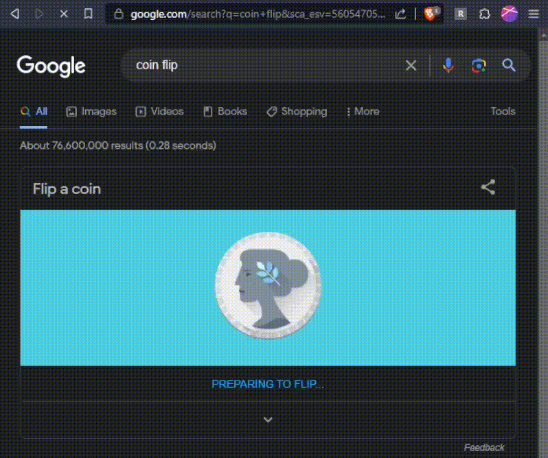

# Rigged Google Coin Flip
Allows you to set the outcome of [Google's Coin Flip tool](https://www.google.com/search?q=google%20coin%20flip)

## This tool in action

## Todo
* [X] Clean up code
    * [X] Add comments
* [X] Make the flipping animation for tails side transition better
* [X] Add a "This tool in action" video

## Install guide
1. Download the GitHub repo by clicking the green "Code" button and clicking "Download ZIP"
    * Alternatively, click [here](https://github.com/Whitelisted1/Google-Coin-Flip-Rigger/archive/refs/heads/main.zip)
2. Unzip the `.zip` file (If you don't know how, there are plenty of guides online)
3. Go to the URL `chrome://extensions`
4. Enable the "Developer Mode" toggle
5. Click "Load unpacked" and navigate to the extracted folder
6. Click "Select Folder" and the extension should load

## Thanks for checking this tool out
If you do like the extension, consider leaving a star
<svg height="16" width="16" viewBox="0 0 16 16" fill="#daaa3f">
    <path d="M8 .25a.75.75 0 0 1 .673.418l1.882 3.815 4.21.612a.75.75 0 0 1 .416 1.279l-3.046 2.97.719 4.192a.751.751 0 0 1-1.088.791L8 12.347l-3.766 1.98a.75.75 0 0 1-1.088-.79l.72-4.194L.818 6.374a.75.75 0 0 1 .416-1.28l4.21-.611L7.327.668A.75.75 0 0 1 8 .25Z"></path>
</svg>